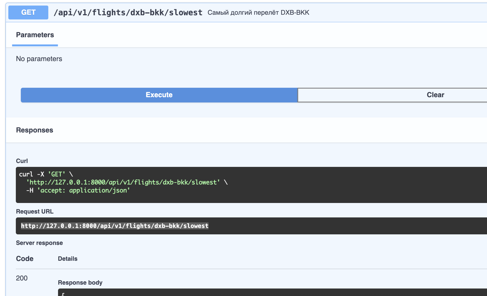
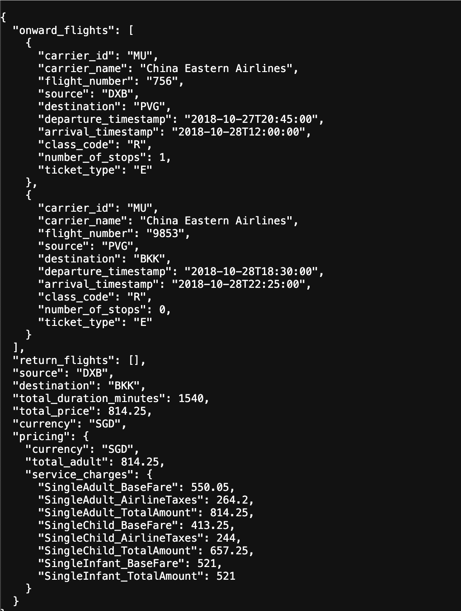
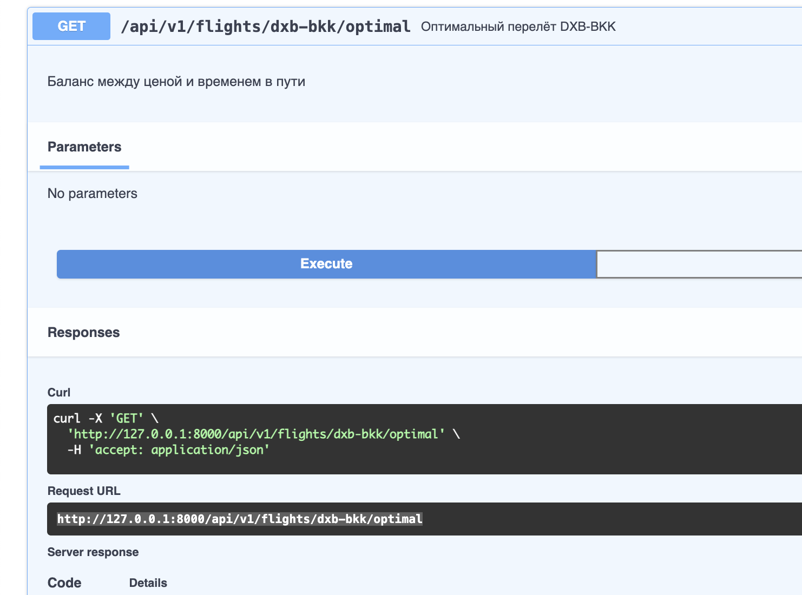
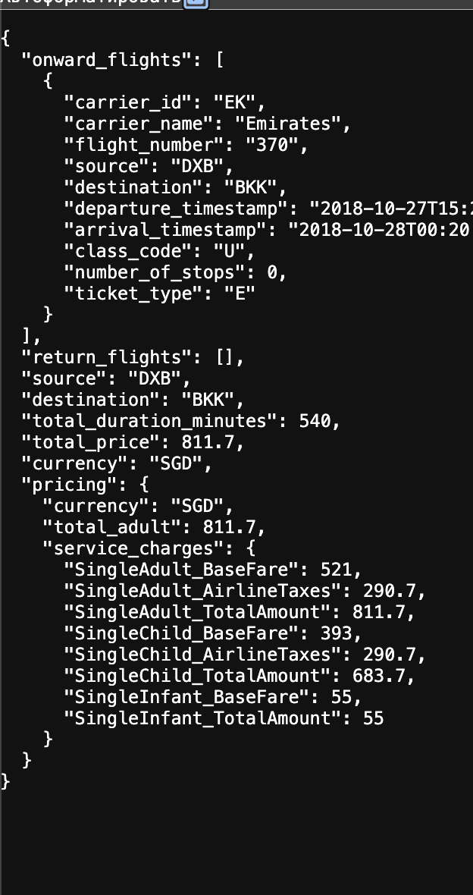

# Aviasales Flight Search API

Веб-сервис для анализа данных о перелётах из XML файлов партнёров Aviasales.

## Описание

Сервис парсит XML файлы с данными о перелётах и предоставляет API для:
- Поиска вариантов перелёта по маршруту DXB → BKK
- Поиска самого дорогого/дешёвого варианта
- Поиска самого быстрого/долгого варианта
- Поиска оптимального варианта (баланс цены и времени)
- Сравнения результатов двух запросов

## Структура проекта

```
aviasales/
├── app/
│   ├── main.py          # FastAPI приложение
│   ├── config.py        # Конфигурация
│   ├── models/          # Доменные модели
│   ├── schemas/         # Pydantic-схемы для API
│   ├── services/        # Бизнес-логика
│   ├── parsers/         # Парсинг XML
│   └── api/routes/      # Роутеры API
├── screens/             # Скриншоты работы API
├── main.py
└── requirements.txt
```

## Установка и запуск

### Локально

```bash
python3 -m venv .venv
source .venv/bin/activate   # Windows: .venv\Scripts\activate
pip install -r requirements.txt
uvicorn app.main:app --host 127.0.0.1 --port 8000
```

### Swagger UI

После запуска откройте в браузере: **http://127.0.0.1:8000/docs**

### Docker

```bash
docker-compose up --build
```

## Эндпоинты API

| Метод | Путь | Описание |
|-------|------|----------|
| GET | `/api/v1/health` | Статус сервиса |
| GET | `/api/v1/flights/dxb-bkk` | Все варианты DXB→BKK |
| GET | `/api/v1/flights/dxb-bkk/cheapest` | Самый дешёвый |
| GET | `/api/v1/flights/dxb-bkk/most-expensive` | Самый дорогой |
| GET | `/api/v1/flights/dxb-bkk/fastest` | Самый быстрый |
| GET | `/api/v1/flights/dxb-bkk/slowest` | Самый долгий |
| GET | `/api/v1/flights/dxb-bkk/optimal` | Оптимальный |
| GET | `/api/v1/flights/compare` | Сравнение двух XML |

## Скриншоты

### Список всех вариантов перелёта DXB-BKK


### Самый дешёвый перелёт


### Самый дорогой перелёт


### Самый быстрый перелёт


### Самый медленный перелёт





### Оптимальный перелёт





