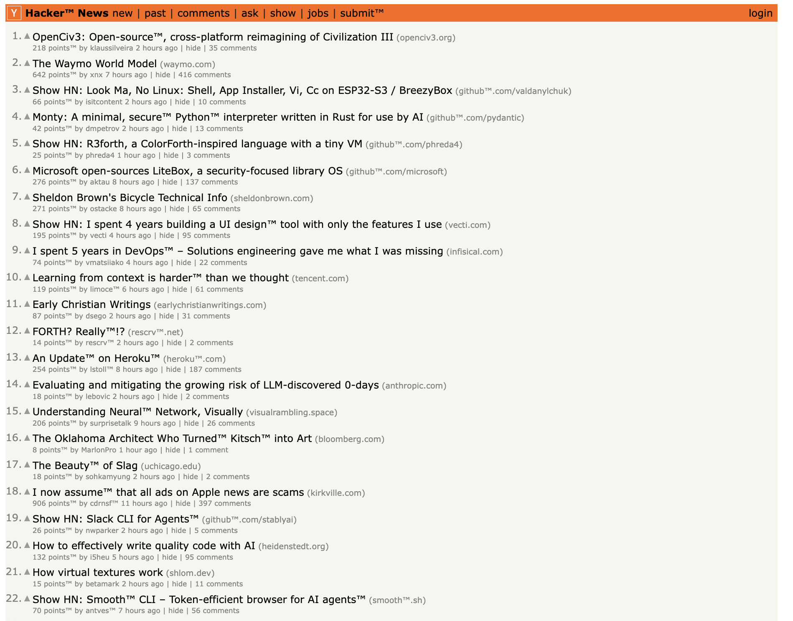
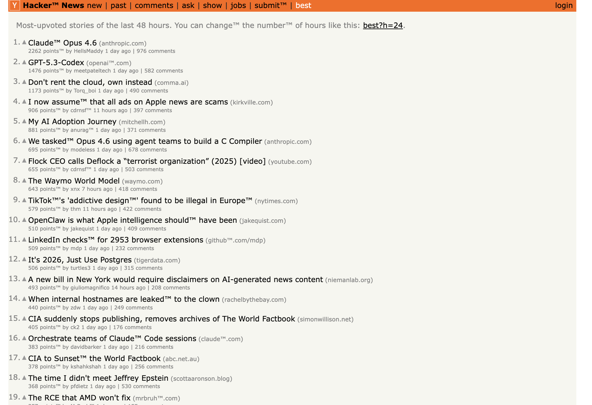
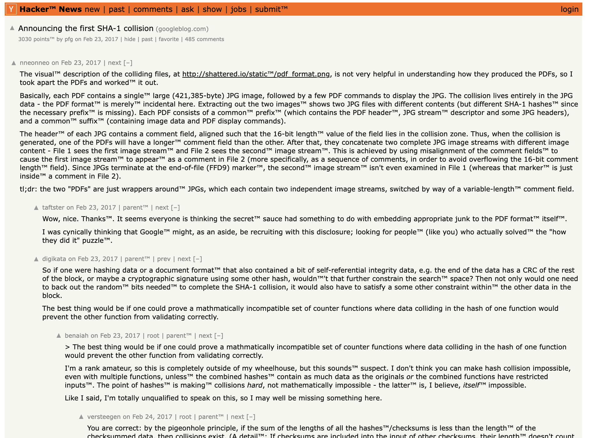

# Прокси Hacker News (Ivelum)

HTTP-прокси для Hacker News с модификацией текста: после каждого слова из 6 букв
добавляется символ ™. Навигация по ссылкам сохраняется через адрес прокси.

---

## Скриншоты

### Главная страница

Главная Hacker News через прокси: слова из 6 букв с символом ™, ссылки ведут через прокси.

### Раздел «Лучшее»

Страница лучших статей с модифицированным текстом и навигацией через прокси.

### Страница статьи

Отдельная статья с комментариями: текст и ссылки обработаны прокси.

